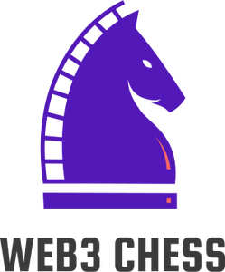

 

  

  <h3 align="center">Play Chess with Friends with Crypto. Mint Your Chess Match.  Earn NFT rewards.</h3>

  

  
   
     
  

    

    ·
    <a href="https://github.com/Udit-takkar/chess/issues">Report Bug</a>
    ·
    <a href="https://github.com/Udit-takkar/chess/issues">Request Feature</a>
  

  
  
A Dapp build on Polygon

  

## ✨ Features
- ♟ Play and Earn:- Stake Crypto to play chess with friends and the winner takes all. You can also play with computer without any staking crypto.
- 🧩Chess Match NFT:- Players can mint NFT of the match they played in form of GIF which would play all the moves played in the match and would also be list this NFT on marketplace. Example :- https://drive.google.com/file/d/1BC-vxcBaLHhLk0QbHLtO9ZLF3Ky3IIIG/view?usp=sharing
- 🪙 Earn NFT:- Winners of the match would also be awarded an NFT which is a meme template with different text on it (opponent name, the date and time) generated using Canvas API.
Example :- https://drive.google.com/file/d/17D8kcoC8g9celsO9cVAsfnptFDvprIUU/view?usp=sharing
- NFT Marketplace :- Users can explore NFT's on the web3 chess marketplace and buy and sell their Web3 chess NFTs leveraging the Polygon Network.
- 📊Dashboard:- It displays the user's balance, All NFT's won/bought by the user in web3 chess, Deposit and Withdraw Matic.

## Tech Stack & Tools

 - React
 - Solidity
 - Moralis
 - IPFS
 - Hardhat
 - Tailwind CSS
 - Polygon
 - OpenZeppelin
 - chess.js

## License

This project is open source and available under the [MIT License](LICENSE).
